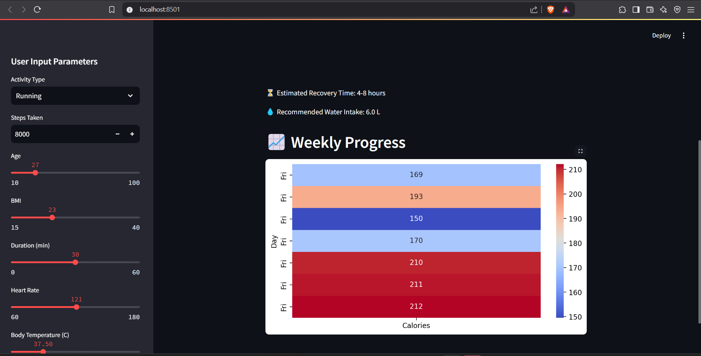
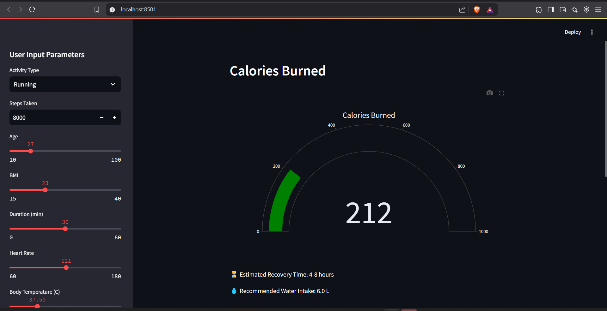
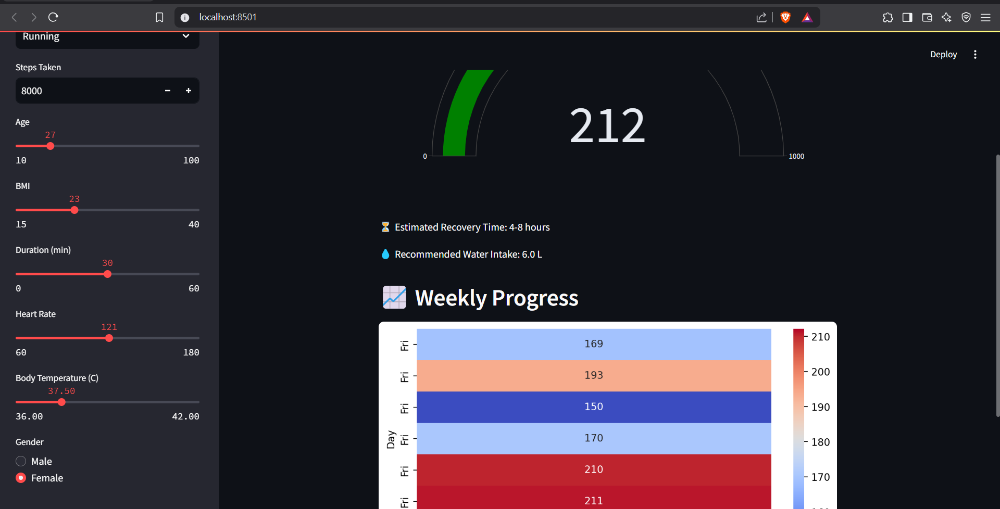

# Fitness Tracker Web App with Calorie Prediction  
*Track your fitness, burn calories, and level up—smart and simple!*

  

## 🏃‍♀ About  
Fitness Tracker Web App with Calorie Prediction uses ML to predict calories burned from your exercise stats—steps, duration, heart rate, and more. Powered by a Random Forest model and built with Streamlit, it delivers interactive gauges, weekly progress heatmaps, recovery tips, and hydration goals. Your fitness journey, upgraded!

## 🛠 Tech Stack  
- **Language**: Python 3.9+  
- **ML Framework**: scikit-learn (RandomForestRegressor)  
- **Web Framework**: Streamlit  
- **Visualization**: Plotly, Seaborn, Matplotlib  
- **Datasets**: calories.csv, exercise.csv  

## 📋 Prerequisites  
- Python 3.9+  
- Git  
- pip  

## ⚡ Quick Start  
1. Clone the repo:  
   bash
   git clone https://github.com/ChRavivarma/fitness-tracker-web-app.git
   
2. Install dependencies:  
   bash
   pip install -r requirements.txt
   
3. Launch the app:  
   bash
   streamlit run app.py
## 🔄 Personal Fitness Tracker - Updates and Changes 

### 1️⃣ Model Improvements  
- Removed **train-test split** → Uses **full dataset** for training.  
- Optimized **RandomForestRegressor** → `n_estimators=100` (faster training).  

### 2️⃣ User Input Changes  
- **New:** "Steps Taken" input.  
- **Increased limits:** Heart rate **130 → 180 bpm**, duration **35 → 60 min**.  
- **BMI auto-calculated** (2 decimal places).  

### 3️⃣ New Features  
✅ **Weekly Progress Tracking** → Stores **7-day calorie trends** with a **heatmap**.  
✅ **Recovery & Hydration Advice** → Estimates recovery time & suggests water intake.  
❌ **Removed "Similar Results" Section** → Focus on **progress tracking**.  

### 4️⃣ UI & Performance  
- 🚀 **Removed loading animation** for a **faster experience**.  
- 📊 **Added Interactive Gauge Chart** for **calorie burn visualization**.  
   
## 🎯 Features  
- **Calorie Burn Prediction**: Enter steps, BMI, duration, etc., and see calories burned instantly.  
- **Visual Gauge**: Cool Plotly gauge for calorie output.  
- **Smart Tips**: Recovery time and water intake based on your stats.  
- **Weekly Tracking**: Heatmap of your last 7 days’ progress.  

## 📊 Sample Output  
| Input            | Value | Result            |  
|------------------|-------|-------------------|  
| Steps            | 8000  | ~212 kcal burned  |  
| Duration         | 30 min| Recovery: 4-6 hrs |  
| Heart Rate       | 135   | Water: 6 L      |  

  

## 🎥 Demo  
See it in action:  

## 🔮 Future Enhancements  
- Sync with fitness wearables for real-time data.  
- Add calorie intake tracking for a full fitness loop.  
- Multi-language support.  

## 🤝 Contribute  
Got ideas? Fork it, code it, PR it! Stars are welcome too!  

## 📬 Contact Information  
- ✨ **GitHub**: [ChRavivarma](https://github.com/ChRavivarma) - *Explore my projects and contributions*  
- 📩 **Email**: [Contact me](mailto:ravivarmachakrala@gmail.com) - *Available for collaboration or inquiries*

